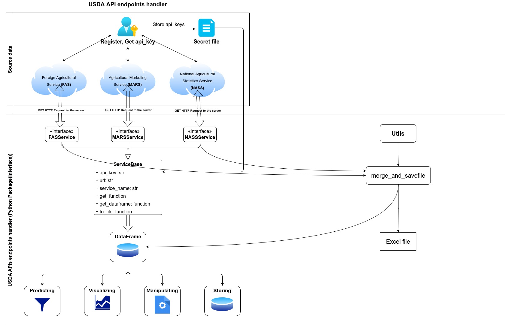

# USDA Python Package
## A USDA APIs endpoints handler
A small python package called USDA, which provides some functions that help you fast receive information from Foreign Agricultural Service (FAS), Agricultural Marketing Service (MARS), and National Agricultural Statistics Service (NASS), and then manipulate with them (sorting, filtering, cleaning and etc). In the future, this package will be extended. There will be a new feature such as Predicting and etc.

### Proof of concept API handler
<p align="center" width="100%">
     
</p>

## Prerequisites:
- Python 3.9+
- pipenv install

## TODOs
- Data manipulating (filter, sorting, etc)
- Store and accumulate data in time
- Predict 

## Command build python package
- python -m build

## Example
```
from src.usda.api.services import NASSService, MARSService, FASService
from pathlib import Path

ROOT_DIR_PATH = Path(__name__).absolute().parent

SETTINGS = {
    "fas": {
        "api_key": "api_key",
        "url": "https://apps.fas.usda.gov/OpenData/swagger/docs/v1",
    },
    "mars": {
        "api_key": "api_key",
        "url": "https://marsapi.ams.usda.gov/services/v1.2",
    },
    "nass": {
        "api_key": "api_key",
        "url": "http://quickstats.nass.usda.gov/api",
    },
}


def main() -> None:
    nass = NASSService(SETTINGS["nass"]["api_key"])
    fas = FASService(SETTINGS["fas"]["api_key"])
    mars = MARSService(SETTINGS["mars"]["api_key"])

    stat_fas = fas.get(endpoint='/gats/countries')
    stat_mars = mars.get(endpoint=mars.EndpointAPI.GET_REPORTS)
    stat_nass = nass.get(endpoints=nass.EndpointAPI.GET_API, params={"commodity_desc":"CORN",
                                                                     "year__GE": "2012",
                                                                     "state_alpha":"VA"})

    for service, name, stat in zip([nass, fas, mars], ['NASS', 'FAS', 'MARS'], [stat_nass, stat_fas, stat_mars]):
        print(f"==========={name}===========")
        print(f"status code: {stat}")
        print(f"url: {service.url}")
        path = service.to_file(ROOT_DIR_PATH)
        print(f"See: {path}")
        print("==========================")
```

<!--  -->
